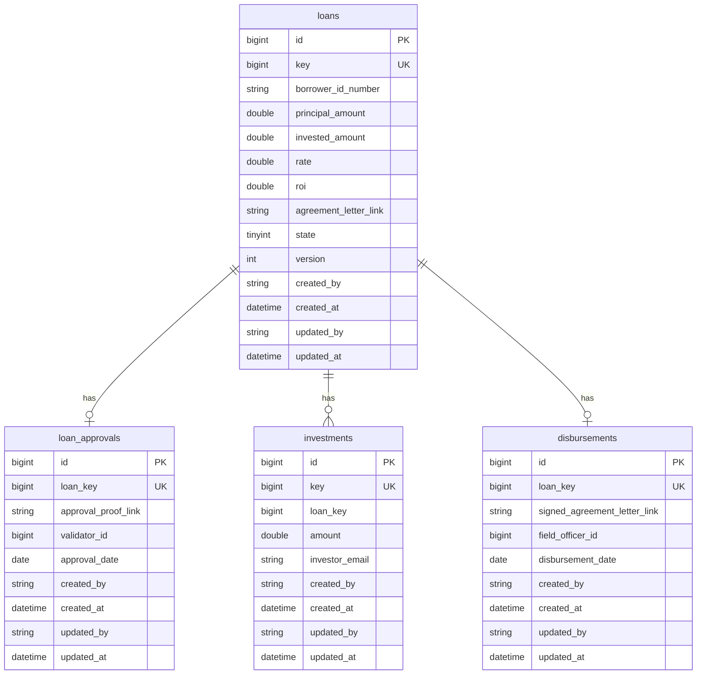
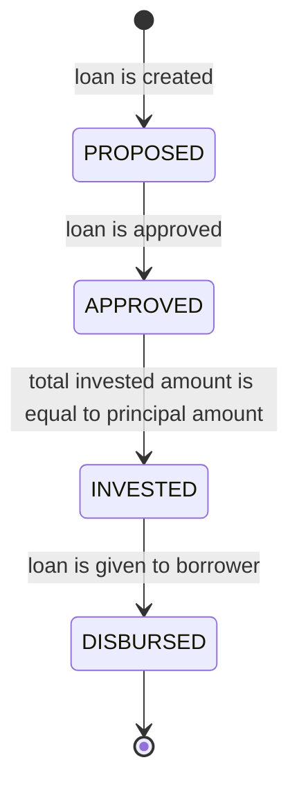
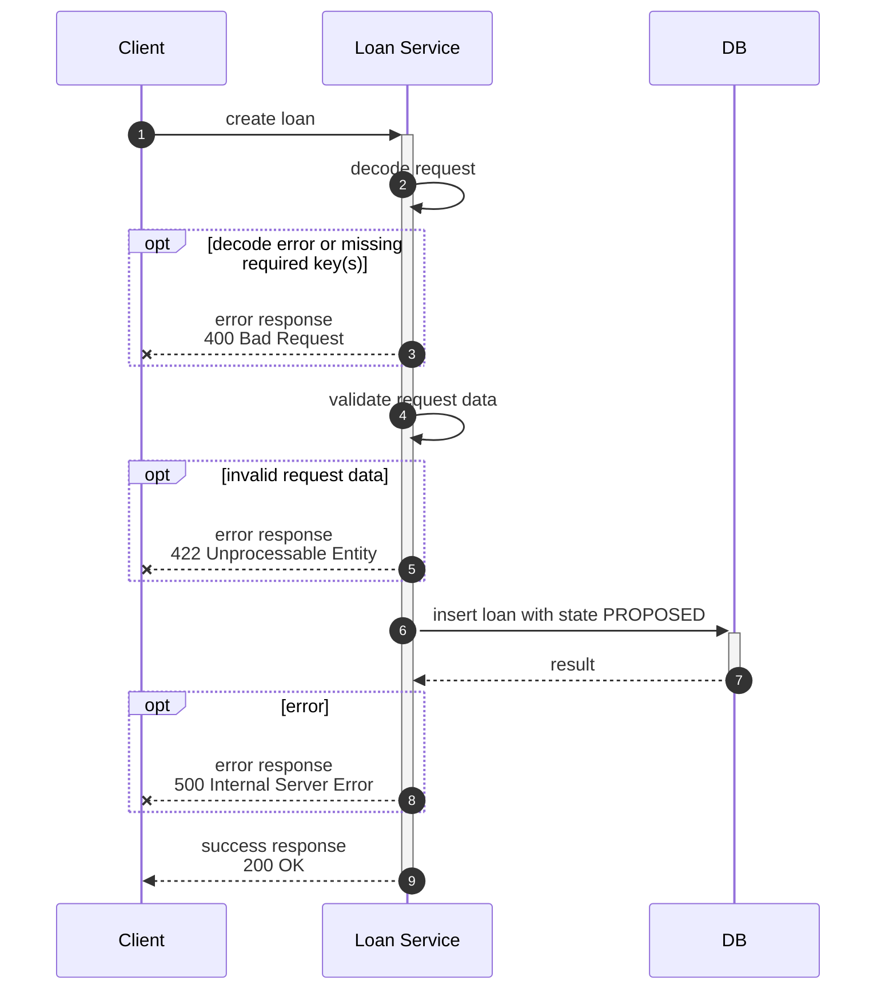
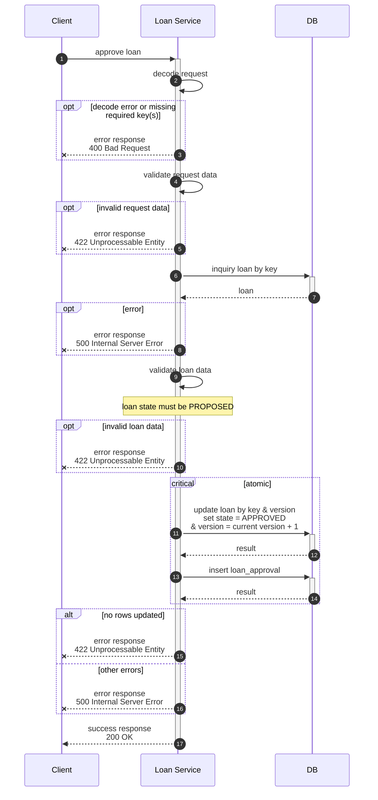
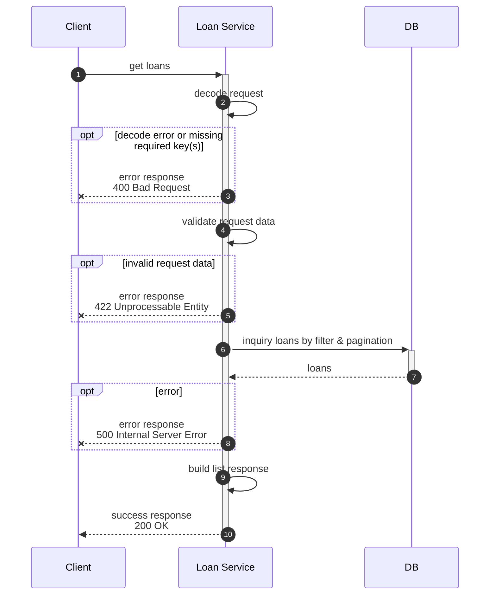
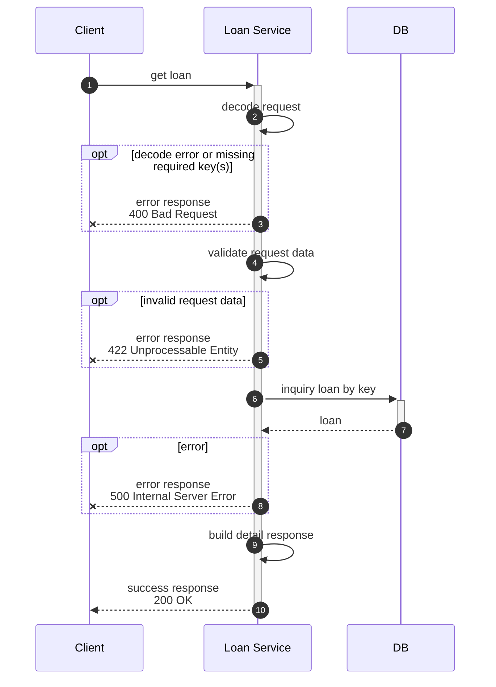
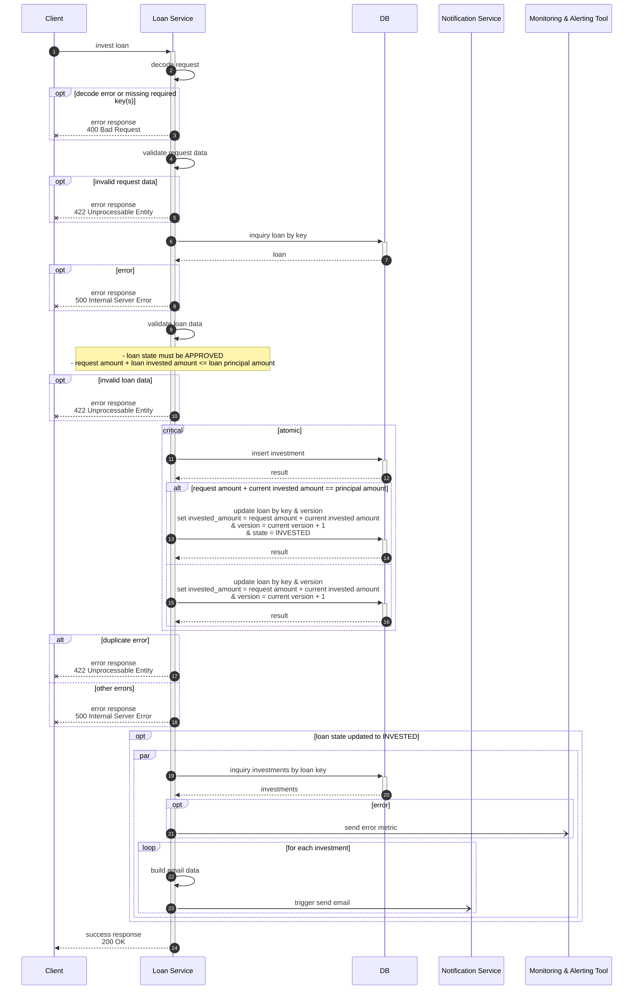

# amartha-loan-service

- [Assumption](#assumption)
- [Scope](#scope)
- [Non-Scope](#non-scope)
- [Future Scope](#future-scope)
- [ERD](#erd)
  * [Loan](#loan)
  * [Loan Approval](#loan-approval)
  * [Investment](#investment)
  * [Disbursement](#disbursement)
- [State Diagram](#state-diagram)
- [Sequence Diagram](#sequence-diagram)
  * [Create Loan](#create-loan)
  * [Approve Loan](#approve-loan)
  * [Get Loans](#get-loans)
  * [Get Loan](#get-loan)
  * [Invest Loan](#invest-loan)
  * [Disburse Loan](#disburse-loan)
- [API Contract](#api-contract)
  * [Create Loan](#create-loan-1)
    + [Request](#request)
    + [Response](#response)
  * [Approve Loan](#approve-loan-1)
    + [Request](#request-1)
    + [Response](#response-1)
  * [Get Loans](#get-loans-1)
    + [Request](#request-2)
    + [Response](#response-2)
  * [Get Loan](#get-loan-1)
    + [Request](#request-3)
    + [Response](#response-3)
  * [Invest Loan](#invest-loan-1)
    + [Request](#request-4)
    + [Response](#response-4)
  * [Disburse Loan](#disburse-loan-1)
    + [Request](#request-5)
    + [Response](#response-5)

## Assumption
- There's no requirement about how the picture proof want to be stored when approving a loan, so I assume we can use link to the document.
- There's no requirement about how the signed agreement letter want to be stored when disbursing a loan, so I assume we can use link to the document.
- There's no requirement about sender of the email when loan state is invested, so I assume we can code the logic only and no email will be actually sent
- There's no requirement that ROI will be generated by system & no information of investment period, so I assume ROI is being set by client when creating a loan.
- There's no requirement about capability of an investor to invest multiple times to a specific loan, so I assume an investor can invest to each loan only once.

## Scope
- Create Loan
- Approve Loan
- Get Loans
- Get Loan
- Invest Loan
- Logic to send email when loan state is invested
- Disburse Loan

## Non-Scope
- Authentication & Authorization
- Employee & User Table
- Send real email
- Monitoring & Alerting

## Future Scope
- Send email using PubSub, instead of looping & sending them one by one in a single process. Purpose:
  - Scalability: Enabling the system to handle high email traffic efficiently by decoupling processing from execution.
  - Flexibility: Allowing seamless integration with different notification or email service in the future, without requiring major architectural changes.
- API ApproveLoan can accept picture proof in file format, then store it to Cloud Storage
- API DisburseLoan can accept signed agreement letter in file format, then store it to Cloud Storage

## ERD


### Loan
Table
|Column|Data Type|Mandatory|Description|
|---|---|---|---|
|id|bigint|Y|PK, id, auto increment|
|key|bigint|Y|UK, key, generated by system|
|borrower_id_number|varchar(20)|Y|borrower id number|
|principal_amount|decimal(30,10)|Y|principal amount|
|invested_amount|decimal(30,10)|Y|invested amount, default zero|
|rate|decimal(5,2)|Y|rate|
|roi|decimal(30,10)|Y|roi (return of investment)|
|agreement_letter_link|bigint|Y|link to agreement letter|
|state|tinyint|Y|state, default 0<li>0 - PROPOSED</li><li>1 - APPROVED</li><li>2 - INVESTED</li><li>3 - DISBURSED</li>|
|version|int|Y|versioning, default 0|
|created_by|varchar(255)|Y|created by|
|created_at|datetime|Y|created at, default current_timestamp|
|updated_by|varchar(255)|N|updated by|
|updated_at|datetime|N|updated at, on update current_timestamp|

Index
|Index|Column|Unique|Description|
|---|---|---|---|
|id|id|Y|primary key on id|
|key|key|Y|unique key on key|
|idx_state|state|N|index on state|

### Loan Approval
Table
|Column|Data Type|Mandatory|Description|
|---|---|---|---|
|id|bigint|Y|PK, id, auto increment|
|loan_key|bigint|Y|UK, reference to loan key|
|approval_proof_link|varchar(255)|Y|link to approval proof|
|validator_id|bigint|Y|validator employee id|
|approval_date|date|Y|approval date|
|created_by|varchar(255)|Y|created by|
|created_at|datetime|Y|created at, default current_timestamp|
|updated_by|varchar(255)|N|updated by|
|updated_at|datetime|N|updated at, on update current_timestamp|

Index
|Index|Column|Unique|Description|
|---|---|---|---|
|id|id|Y|primary key on id|
|loan_key|loan_key|Y|unique key on loan_key|

### Investment
Table
|Column|Data Type|Mandatory|Description|
|---|---|---|---|
|id|bigint|Y|PK, id, auto increment|
|key|bigint|Y|UK, key, generated by system|
|loan_key|bigint|Y|reference to loan key|
|amount|decimal(30,10)|Y|investment amount|
|investor_email|varchar(255)|Y|UK, key, generated by system|
|created_by|varchar(255)|Y|created by|
|created_at|datetime|Y|created at, default current_timestamp|
|updated_by|varchar(255)|N|updated by|
|updated_at|datetime|N|updated at, on update current_timestamp|

Index
|Index|Column|Unique|Description|
|---|---|---|---|
|id|id|Y|primary key on id|
|key|key|Y|unique key on key|
|idx_loan_key_investor_email|loan_key|Y|composite unique index on loan_key, investor_email|

### Disbursement
Table
|Column|Data Type|Mandatory|Description|
|---|---|---|---|
|id|bigint|Y|PK, id, auto increment|
|loan_key|bigint|Y|UK, reference to loan key|
|signed_agreement_letter_link|varchar(255)|Y|PK, id, auto increment|
|field_officer_id|bigint|Y|field officer employee id|
|disbursement_date|date|Y|disbursement date|
|created_by|varchar(255)|Y|created by|
|created_at|datetime|Y|created at, default current_timestamp|
|updated_by|varchar(255)|N|updated by|
|updated_at|datetime|N|updated at, on update current_timestamp|

Index
|Index|Column|Unique|Description|
|---|---|---|---|
|id|id|Y|primary key on id|
|loan_key|loan_key|Y|unique key on loan_key|

## State Diagram


## Sequence Diagram

### Create Loan


### Approve Loan


### Get Loans


### Get Loan


### Invest Loan


### Disburse Loan


## API Contract

### Create Loan
<table>
 <tr>
  <th>Path</th>
  <td><code>/loans/create</code></td>
 </tr>
 <tr>
  <th>Method</th>
  <td>POST</td>
 </tr>
</table>

#### Request
Headers
|Name|Data Type|Mandatory|Description|
|---|---|---|---|
|Content-Type|string|Y|content type<li>application/json</li>|

Body
<table>
 <tr>
  <th>Name</th>
  <th>Data Type</th>
  <th>Mandatory</th>
  <th>Description</th>
 </tr>
 <tr>
  <td>borrower_id_number</td>
  <td>string</td>
  <td>Y</td>
  <td>borrower id number</td>
 </tr>
 <tr>
  <td>principal_amount</td>
  <td>float64</td>
  <td>Y</td>
  <td>principal amount</td>
 </tr>
 <tr>
  <td>rate</td>
  <td>float64</td>
  <td>Y</td>
  <td>rate</td>
 </tr>
 <tr>
  <td>roi</td>
  <td>float64</td>
  <td>Y</td>
  <td>roi (return of investment)</td>
 </tr>
 <tr>
  <td>agreement_letter_link</td>
  <td>string</td>
  <td>Y</td>
  <td>link to agreement letter</td>
 </tr>
</table>

<details>
<summary>example</summary>

```json
{
  "borrower_id_number": "1111114101010001",
  "principal_amount": 10000000,
  "rate": 10,
  "roi": 11000000,
  "agreement_letter_link": "https://drive.google.com/file/d/e892b618945a/view"
}
```
</details>

#### Response
<table>
 <tr>
  <th colspan="2">Name</th>
  <th>Data Type</th>
  <th>Mandatory</th>
  <th>Description</th>
 </tr>
 <tr>
  <td colspan="2">message</td>
  <td>string</td>
  <td>Y</td>
  <td>message</td>
 </tr>
 <tr>
  <td colspan="2">data</td>
  <td>struct</td>
  <td>N</td>
  <td>data</td>
 </tr>
 <tr>
  <td></td>
  <td>key</td>
  <td>uint64</td>
  <td>Y</td>
  <td>loan key</td>
 </tr>
</table>

<details>
<summary>example</summary>

```json
{
  "message": "success",
  "data": {
    "key": 1906440385451624682
  }
}
```
</details>

### Approve Loan
<table>
 <tr>
  <th>Path</th>
  <td><code>/loans/{key}/approve</code></td>
 </tr>
 <tr>
  <th>Method</th>
  <td>POST</td>
 </tr>
</table>

#### Request
Path Params
|Name|Data Type|Mandatory|Description|
|---|---|---|---|
|key|uint64|Y|loan key|

<details>
<summary>example</summary>

```
POST /loans/1906440385451624700/approve
```
</details>

Headers
|Name|Data Type|Mandatory|Description|
|---|---|---|---|
|Content-Type|string|Y|content type<li>application/json</li>|

Body
<table>
 <tr>
  <th>Name</th>
  <th>Data Type</th>
  <th>Mandatory</th>
  <th>Description</th>
 </tr>
 <tr>
  <td>approval_proof_link</td>
  <td>string</td>
  <td>Y</td>
  <td>link to approval proof</td>
 </tr>
 <tr>
  <td>validator_id</td>
  <td>uint64</td>
  <td>Y</td>
  <td>validator employee id</td>
 </tr>
 <tr>
  <td>approval_date</td>
  <td>string</td>
  <td>Y</td>
  <td>approval date, format YYYY-MM-DD</td>
 </tr>
</table>

<details>
<summary>example</summary>

```json
{
  "approval_proof_link": "https://drive.google.com/file/d/d7921805c400/view",
  "validator_id": 4276,
  "approval_date": "2025-03-24"
}
```
</details>

#### Response
<table>
 <tr>
  <th colspan="2">Name</th>
  <th>Data Type</th>
  <th>Mandatory</th>
  <th>Description</th>
 </tr>
 <tr>
  <td colspan="2">message</td>
  <td>string</td>
  <td>Y</td>
  <td>message</td>
 </tr>
 <tr>
  <td colspan="2">data</td>
  <td>struct</td>
  <td>N</td>
  <td>data</td>
 </tr>
 <tr>
  <td></td>
  <td>key</td>
  <td>uint64</td>
  <td>Y</td>
  <td>loan key</td>
 </tr>
</table>

<details>
<summary>example</summary>

```json
{
  "message": "success",
  "data": {
    "key": 1906440385451624700
  }
}
```
</details>

### Get Loans
<table>
 <tr>
  <th>Path</th>
  <td><code>/loans</code></td>
 </tr>
 <tr>
  <th>Method</th>
  <td>GET</td>
 </tr>
</table>

#### Request
Query Params
<table>
 <tr>
  <th>Name</th>
  <th>Data Type</th>
  <th>Mandatory</th>
  <th>Description</th>
 </tr>
 <tr>
  <td>state</td>
  <td>string</td>
  <td>N</td>
  <td>state, default empty<li>PROPOSED</li><li>APPROVED</li><li>INVESTED</li><li>DISBURSED</li></li></td>
 </tr>
 <tr>
  <td>page</td>
  <td>int</td>
  <td>N</td>
  <td>page, default 1</td>
 </tr>
 <tr>
  <td>per_page</td>
  <td>int</td>
  <td>N</td>
  <td>number of items per page, default 5</td>
 </tr>
</table>

<details>
<summary>example</summary>

```json
GET /loans?state=APPROVED&page=2&per_page=10
```
</details>

#### Response
<table>
 <tr>
  <th colspan="2">Name</th>
  <th>Data Type</th>
  <th>Mandatory</th>
  <th>Description</th>
 </tr>
 <tr>
  <td colspan="2">message</td>
  <td>string</td>
  <td>Y</td>
  <td>message</td>
 </tr>
 <tr>
  <td colspan="2">data</td>
  <td>array</td>
  <td>N</td>
  <td>data</td>
 </tr>
 <tr>
  <td></td>
  <td>key</td>
  <td>uint64</td>
  <td>Y</td>
  <td>loan key</td>
 </tr>
 <tr>
  <td></td>
  <td>principal_amount</td>
  <td>float64</td>
  <td>Y</td>
  <td>principal amount</td>
 </tr>
 <tr>
  <td></td>
  <td>invested_amount</td>
  <td>float64</td>
  <td>Y</td>
  <td>invested amount</td>
 </tr>
 <tr>
  <td></td>
  <td>rate</td>
  <td>float64</td>
  <td>Y</td>
  <td>rate</td>
 </tr>
 <tr>
  <td></td>
  <td>roi</td>
  <td>float64</td>
  <td>Y</td>
  <td>roi (return of investment)</td>
 </tr>
 <tr>
  <td></td>
  <td>state</td>
  <td>string</td>
  <td>Y</td>
  <td>state<li>PROPOSED</li><li>APPROVED</li><li>INVESTED</li><li>DISBURSED</li></td>
 </tr>
 <tr>
  <td></td>
  <td>created_at</td>
  <td>string</td>
  <td>Y</td>
  <td>created at</td>
 </tr>
</table>

<details>
<summary>example</summary>

```json
{
  "message": "success",
  "data": [
    {
      "key": 1906440385451624700,
      "principal_amount": 10000000,
      "invested_amount": 0,
      "rate": 10,
      "roi": 11000000,
      "state": "APPROVED",
      "created_at": "2025-03-22T21:53:45+07:00"
    }
  ]
}
```
</details>

### Get Loan
<table>
 <tr>
  <th>Path</th>
  <td><code>/loans/{key}</code></td>
 </tr>
 <tr>
  <th>Method</th>
  <td>GET</td>
 </tr>
</table>

#### Request
Path Params
|Name|Data Type|Mandatory|Description|
|---|---|---|---|
|key|uint64|Y|loan key|

<details>
<summary>example</summary>

```
GET /loans/1906440385451624700
```
</details>

#### Response
<table>
 <tr>
  <th colspan="2">Name</th>
  <th>Data Type</th>
  <th>Mandatory</th>
  <th>Description</th>
 </tr>
 <tr>
  <td colspan="2">message</td>
  <td>string</td>
  <td>Y</td>
  <td>message</td>
 </tr>
 <tr>
  <td colspan="2">data</td>
  <td>struct</td>
  <td>N</td>
  <td>data</td>
 </tr>
 <tr>
  <td></td>
  <td>key</td>
  <td>uint64</td>
  <td>Y</td>
  <td>loan key</td>
 </tr>
 <tr>
  <td></td>
  <td>principal_amount</td>
  <td>float64</td>
  <td>Y</td>
  <td>principal amount</td>
 </tr>
 <tr>
  <td></td>
  <td>invested_amount</td>
  <td>float64</td>
  <td>Y</td>
  <td>invested amount</td>
 </tr>
 <tr>
  <td></td>
  <td>rate</td>
  <td>float64</td>
  <td>Y</td>
  <td>rate</td>
 </tr>
 <tr>
  <td></td>
  <td>roi</td>
  <td>float64</td>
  <td>Y</td>
  <td>roi (return of investment)</td>
 </tr>
 <tr>
  <td></td>
  <td>state</td>
  <td>string</td>
  <td>Y</td>
  <td>state<li>PROPOSED</li><li>APPROVED</li><li>INVESTED</li><li>DISBURSED</li></td>
 </tr>
 <tr>
  <td></td>
  <td>created_at</td>
  <td>string</td>
  <td>Y</td>
  <td>created at</td>
 </tr>
</table>

<details>
<summary>example</summary>

```json
{
  "message": "success",
  "data": {
    "key": 1906440385451624700,
    "principal_amount": 10000000,
    "invested_amount": 0,
    "rate": 10,
    "roi": 11000000,
    "state": "APPROVED",
    "created_at": "2025-03-22T21:53:45+07:00"
  }
}
```
</details>

### Invest Loan
<table>
 <tr>
  <th>Path</th>
  <td><code>/loans/{key}/invest</code></td>
 </tr>
 <tr>
  <th>Method</th>
  <td>POST</td>
 </tr>
</table>

#### Request
Path Params
|Name|Data Type|Mandatory|Description|
|---|---|---|---|
|key|uint64|Y|loan key|

<details>
<summary>example</summary>

```
POST /loans/1906440385451624700/invest
```
</details>

Headers
|Name|Data Type|Mandatory|Description|
|---|---|---|---|
|Content-Type|string|Y|content type<li>application/json</li>|

Body
<table>
 <tr>
  <th>Name</th>
  <th>Data Type</th>
  <th>Mandatory</th>
  <th>Description</th>
 </tr>
 <tr>
  <td>amount</td>
  <td>float64</td>
  <td>Y</td>
  <td>investment amount</td>
 </tr>
 <tr>
  <td>investor_email</td>
  <td>string</td>
  <td>Y</td>
  <td>investor email</td>
 </tr>
</table>

<details>
<summary>example</summary>

```json
{
  "amount": 1000000,
  "investor_email": "investor@gmail.com"
}
```
</details>

#### Response
<table>
 <tr>
  <th colspan="2">Name</th>
  <th>Data Type</th>
  <th>Mandatory</th>
  <th>Description</th>
 </tr>
 <tr>
  <td colspan="2">message</td>
  <td>string</td>
  <td>Y</td>
  <td>message</td>
 </tr>
 <tr>
  <td colspan="2">data</td>
  <td>struct</td>
  <td>N</td>
  <td>data</td>
 </tr>
 <tr>
  <td></td>
  <td>key</td>
  <td>uint64</td>
  <td>Y</td>
  <td>loan key</td>
 </tr>
 <tr>
  <td></td>
  <td>investment_key</td>
  <td>uint64</td>
  <td>Y</td>
  <td>investment key</td>
 </tr>
</table>

<details>
<summary>example</summary>

```json
{
  "message": "success",
  "data": {
    "key": 1906440385451624700,
    "investment_key": 1906724875374789400
  }
}
```
</details>

### Disburse Loan
<table>
 <tr>
  <th>Path</th>
  <td><code>/loans/{key}/disburse</code></td>
 </tr>
 <tr>
  <th>Method</th>
  <td>POST</td>
 </tr>
</table>

#### Request
Path Params
|Name|Data Type|Mandatory|Description|
|---|---|---|---|
|key|uint64|Y|loan key|

<details>
<summary>example</summary>

```
POST /loans/1906440385451624700/disburse
```
</details>

Headers
|Name|Data Type|Mandatory|Description|
|---|---|---|---|
|Content-Type|string|Y|content type<li>application/json</li>|

Body
<table>
 <tr>
  <th>Name</th>
  <th>Data Type</th>
  <th>Mandatory</th>
  <th>Description</th>
 </tr>
 <tr>
  <td>signed_agreement_letter_link</td>
  <td>string</td>
  <td>Y</td>
  <td>link to signed agreement letter</td>
 </tr>
 <tr>
  <td>field_officer_id</td>
  <td>uint64</td>
  <td>Y</td>
  <td>field officer employee id</td>
 </tr>
 <tr>
  <td>disbursement_date</td>
  <td>string</td>
  <td>Y</td>
  <td>disbursement date, format YYYY-MM-DD</td>
 </tr>
</table>

<details>
<summary>example</summary>

```json
{
  "signed_agreement_letter_link": "https://drive.google.com/file/d/0a17a8e51ae0/view",
  "field_officer_id": 4329,
  "disbursement_date": "2025-03-29"
}
```
</details>

#### Response
<table>
 <tr>
  <th colspan="2">Name</th>
  <th>Data Type</th>
  <th>Mandatory</th>
  <th>Description</th>
 </tr>
 <tr>
  <td colspan="2">message</td>
  <td>string</td>
  <td>Y</td>
  <td>message</td>
 </tr>
 <tr>
  <td colspan="2">data</td>
  <td>struct</td>
  <td>N</td>
  <td>data</td>
 </tr>
 <tr>
  <td></td>
  <td>key</td>
  <td>uint64</td>
  <td>Y</td>
  <td>loan key</td>
 </tr>
</table>

<details>
<summary>example</summary>

```json
{
  "message": "success",
  "data": {
    "key": 1906440385451624700
  }
}
```
</details>
