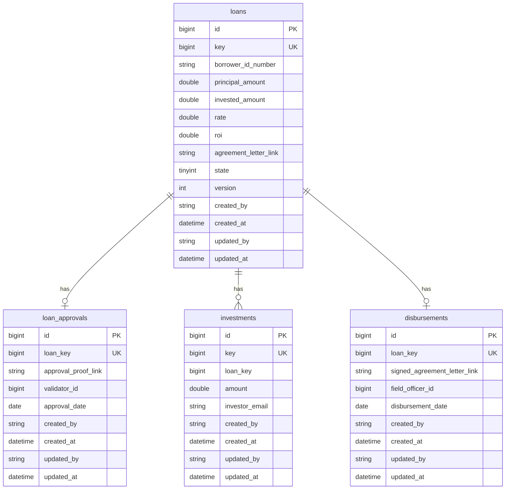
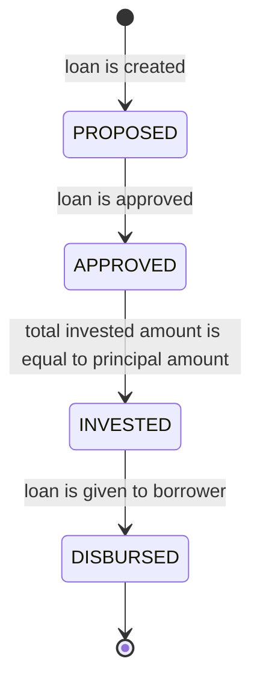
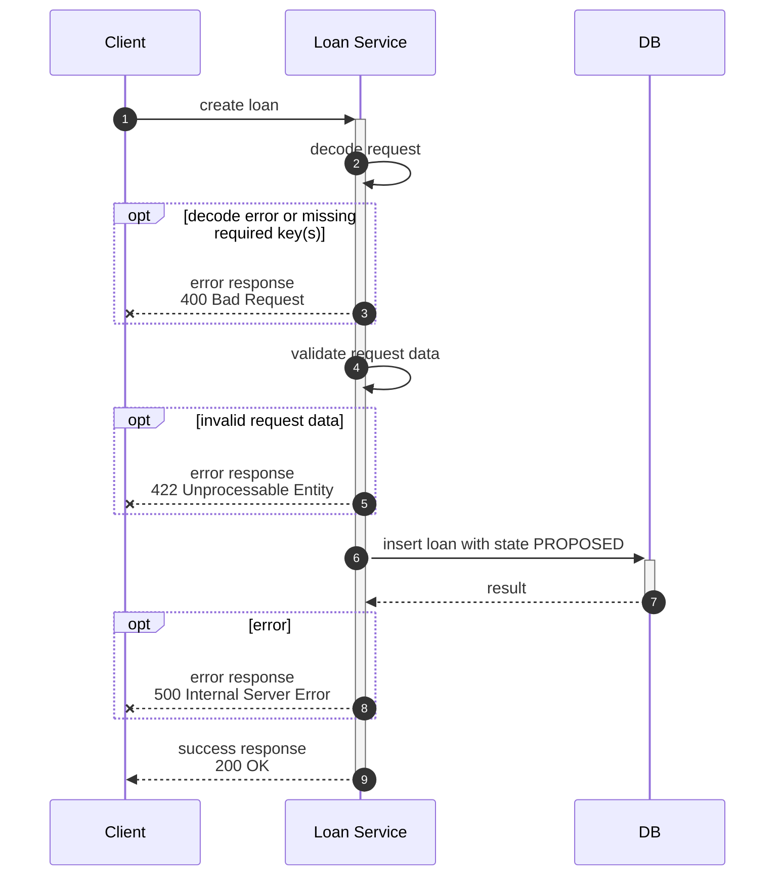
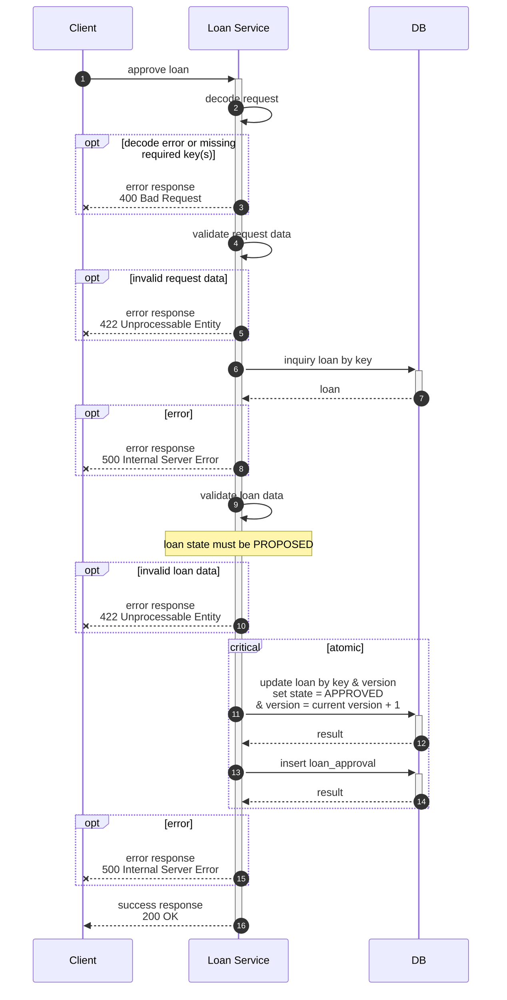
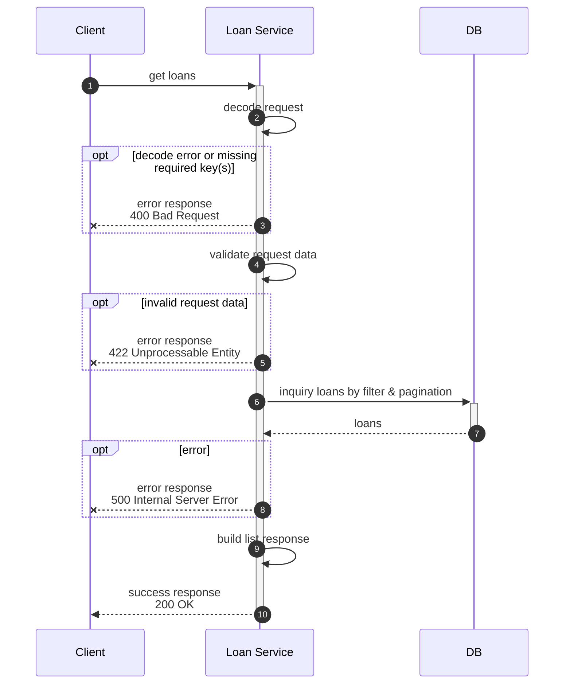
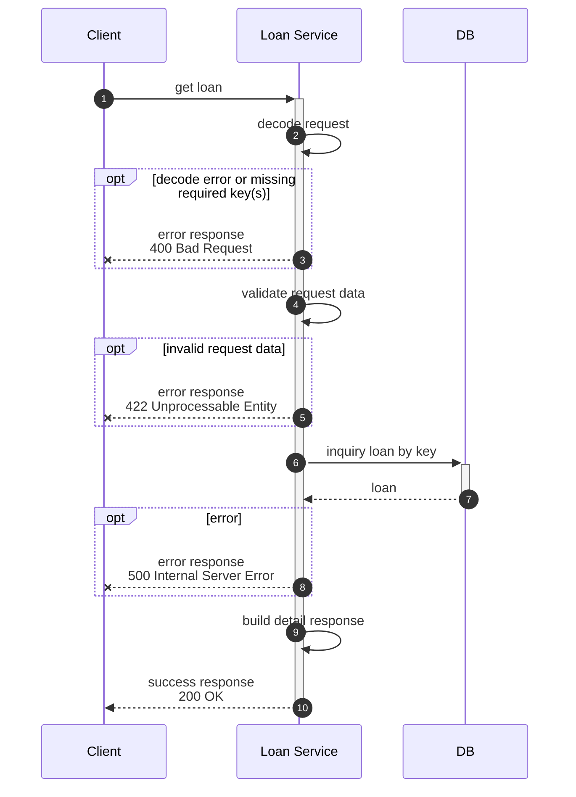

# amartha-loan-service

- [Assumption](#assumption)
- [Scope](#scope)
- [Non-Scope](#non-scope)
- [Future Scope](#future-scope)
- [ERD](#erd)
  * [Loan](#loan)
  * [Loan Approval](#loan-approval)
  * [Investment](#investment)
  * [Disbursement](#disbursement)
- [State Diagram](#state-diagram)
- [Sequence Diagram](#sequence-diagram)
  * [Create Loan](#create-loan)
  * [Approve Loan](#approve-loan)
  * [Get Loans](#get-loans)
  * [Get Loan](#get-loan)
  * [Invest Loan](#invest-loan)
  * [Disburse Loan](#disburse-loan)

## Assumption
- There's no requirement about how the picture proof want to be stored when approving a loan, so I assume we can use link to the document.
- There's no requirement about how the signed agreement letter want to be stored when disbursing a loan, so I assume we can use link to the document.
- There's no requirement about sender of the email when loan state is invested, so I assume we can code the logic only and no email will be actually sent
- There's no requirement that ROI will be generated by system & no information of investment period, so I assume ROI is being set by client when creating a loan.
- There's no requirement about capability of an investor to invest multiple times to a specific loan, so I assume an investor can invest to each loan only once.

## Scope
- Create Loan
- Approve Loan
- Get Loans
- Get Loan
- Invest Loan
- Logic to send email when loan state is invested
- Disburse Loan

## Non-Scope
- Authentication & Authorization
- Employee & User Table
- Send real email

## Future Scope
- Send email using PubSub, instead of looping & sending them one by one in a single process. Purpose:
  - Scalability: Enabling the system to handle high email traffic efficiently by decoupling processing from execution.
  - Flexibility: Allowing seamless integration with different notification or email service in the future, without requiring major architectural changes.
- API ApproveLoan can accept picture proof in file format, then store it to Cloud Storage
- API DisburseLoan can accept signed agreement letter in file format, then store it to Cloud Storage

## ERD


### Loan
Table
|Column|Data Type|Mandatory|Description|
|---|---|---|---|
|id|bigint|Y|PK, id, auto increment|
|key|bigint|Y|UK, key, generated by system|
|borrower_id_number|varchar(20)|Y|borrower id number|
|principal_amount|decimal(30,10)|Y|principal amount|
|invested_amount|decimal(30,10)|Y|invested amount, default zero|
|rate|decimal(5,2)|Y|rate|
|roi|decimal(30,10)|Y|roi (return of investment)|
|agreement_letter_link|bigint|Y|link to agreement letter|
|state|tinyint|Y|state, default 0<li>0 - PROPOSED</li><li>1 - APPROVED</li><li>2 - INVESTED</li><li>3 - DISBURSED</li>|
|version|int|Y|versioning, default 0|
|created_by|varchar(255)|Y|created by|
|created_at|datetime|Y|created at, default current_timestamp|
|updated_by|varchar(255)|N|updated by|
|updated_at|datetime|N|updated at, on update current_timestamp|

Index
|Index|Column|Unique|Description|
|---|---|---|---|
|id|id|Y|primary key on id|
|key|key|Y|unique key on key|

### Loan Approval
Table
|Column|Data Type|Mandatory|Description|
|---|---|---|---|
|id|bigint|Y|PK, id, auto increment|
|loan_key|bigint|Y|UK, reference to loan key|
|approval_proof_link|varchar(255)|Y|link to approval proof|
|validator_id|bigint|Y|validator employee id|
|approval_date|date|Y|approval date|
|created_by|varchar(255)|Y|created by|
|created_at|datetime|Y|created at, default current_timestamp|
|updated_by|varchar(255)|N|updated by|
|updated_at|datetime|N|updated at, on update current_timestamp|

Index
|Index|Column|Unique|Description|
|---|---|---|---|
|id|id|Y|primary key on id|
|loan_key|loan_key|Y|unique key on loan_key|

### Investment
Table
|Column|Data Type|Mandatory|Description|
|---|---|---|---|
|id|bigint|Y|PK, id, auto increment|
|key|bigint|Y|UK, key, generated by system|
|loan_key|bigint|Y|reference to loan key|
|amount|decimal(30,10)|Y|investment amount|
|investor_email|varchar(255)|Y|UK, key, generated by system|
|created_by|varchar(255)|Y|created by|
|created_at|datetime|Y|created at, default current_timestamp|
|updated_by|varchar(255)|N|updated by|
|updated_at|datetime|N|updated at, on update current_timestamp|

Index
|Index|Column|Unique|Description|
|---|---|---|---|
|id|id|Y|primary key on id|
|key|key|Y|unique key on key|
|idx_loan_key_investor_email|loan_key|Y|composite unique index on loan_key, investor_email|

### Disbursement
Table
|Column|Data Type|Mandatory|Description|
|---|---|---|---|
|id|bigint|Y|PK, id, auto increment|
|loan_key|bigint|Y|UK, reference to loan key|
|signed_agreement_letter_link|varchar(255)|Y|PK, id, auto increment|
|field_officer_id|bigint|Y|field officer employee id|
|disbursement_date|date|Y|disbursement date|
|created_by|varchar(255)|Y|created by|
|created_at|datetime|Y|created at, default current_timestamp|
|updated_by|varchar(255)|N|updated by|
|updated_at|datetime|N|updated at, on update current_timestamp|

Index
|Index|Column|Unique|Description|
|---|---|---|---|
|id|id|Y|primary key on id|
|loan_key|loan_key|Y|unique key on loan_key|

## State Diagram


## Sequence Diagram

### Create Loan


### Approve Loan


### Get Loans


### Get Loan


### Invest Loan
```mermaid
```

### Disburse Loan
```mermaid
```
